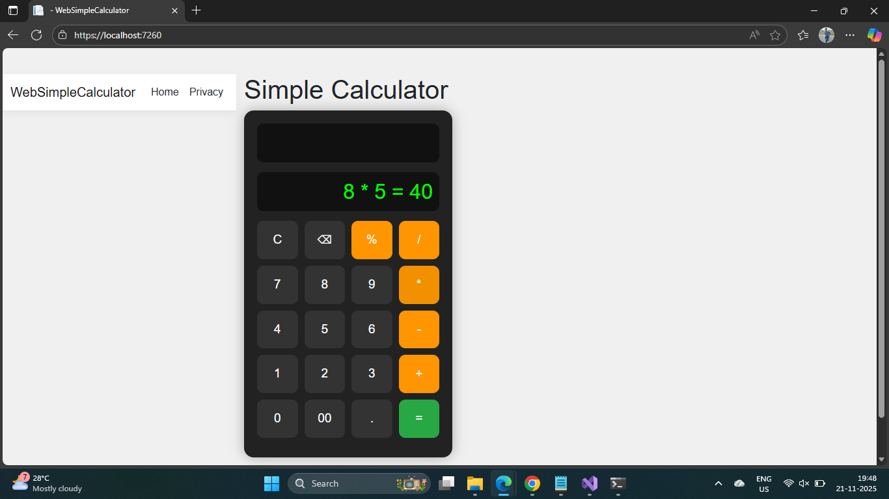

# 📟 Simple Calculator (ASP.NET Core MVC)
A clean, modern, and interactive web-based calculator built using ASP.NET Core MVC. This project demonstrates Razor views, model binding, controllers, JavaScript integration, and a polished UI. Ideal for beginners learning ASP.NET MVC or anyone wanting a simple demo application.

✨ Features
🔢 Calculator Operations
Addition (+)
Subtraction (-)
Multiplication (×)
Division (÷)
Modulus (%)
Handles divide-by-zero safely (returns NaN)

🧠 Interactive Frontend
Button-based numeric entry
Operator selection
Clear screen (C)
Backspace (⌫)
Automatic hidden field population on submit
Smooth result display after each calculation

🎨 UI & UX
Dark theme calculator design
Responsive grid button layout
Styled displays for input and results
Hover and active animations

🏗️ Built With
ASP.NET Core MVC 6/7/8+
C#
Razor Pages
HTML5 / CSS3 / JavaScript

